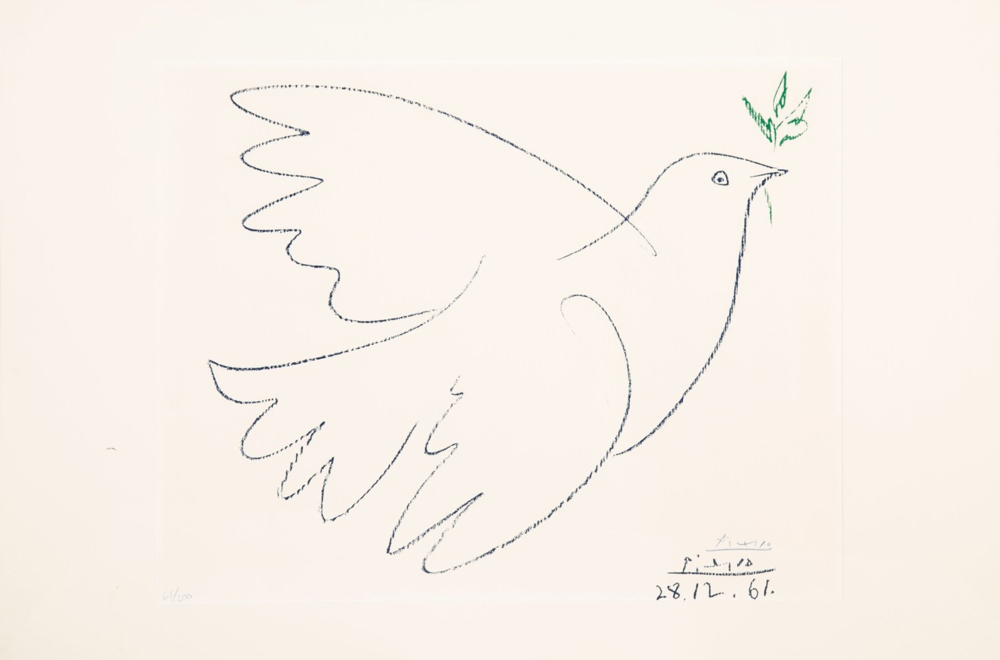
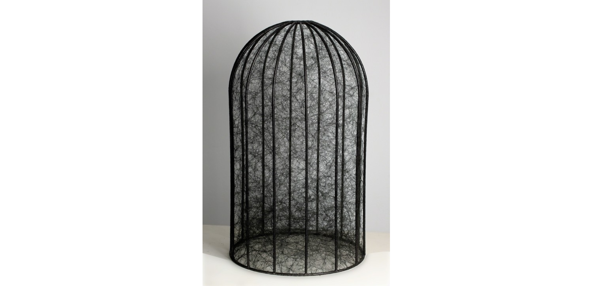
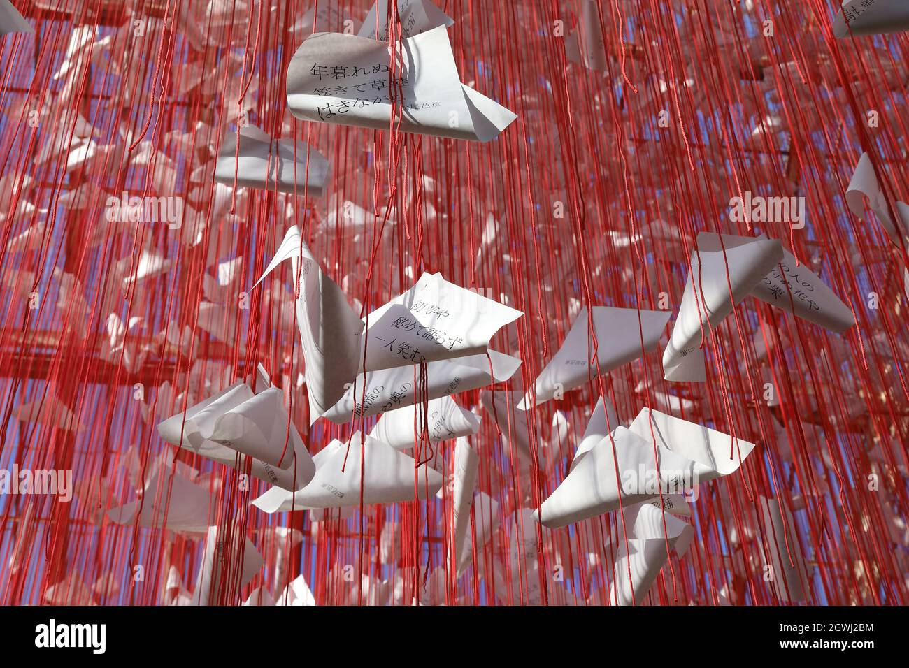
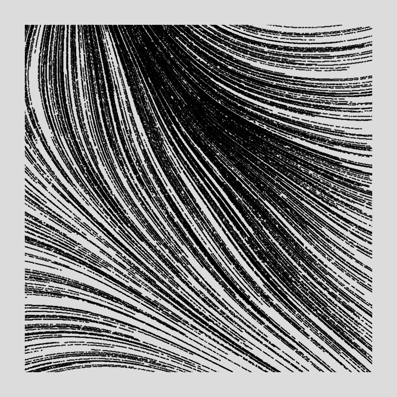

# Quiz-8
### Shuhan Shen

### Imaging Technique Inspiration: 
For my major project, I would like to choose this beautiful art from Pablo Picasso.

>#### *L'homme est né libre, et partout il est dans les fers.*

<!-- This painting is composed of seemingly random yet precise and powerful lines, it reminds me of another artist who creates deeply moving works through the use of lines— **Chiharu Shiota**. -->

(State of Being,Bird Cage., 2011)

>- Why these arts?
    - Art is always filled with dramatic tension. The dove holding an olive branch appears free, but it is confined within the frame of the painting, a form of a cage. The seemingly powerful, free-flowing lines can also be trapped within the confines of a cage made of lines. I love how Chiharu Shiota explores the concept of structure through her use of lines.

(One Thousand Springs., 2021) 

>- Which aspects?
    - Contrast the dynamics of the bird breaking free from invisible constraints with **Perlin noise and random values** to drive animation., creating an animation where the lines on the bird and in the environment evolve in interesting ways as time progresses.
  

#### Useful Coding Technique:
>#### noise()

>- How might it contribute to my work?
    - I want to use `Perlin noise()` to help create a background filled with tension, reflecting the tug-of-war between the bird's free will and the invisible magnetic field. This background will constantly change, full of uncertainty and randomness, showcasing dramatic tension in the artwork.

[click here to see example implementations](https://www.gorillasun.de/blog/perlin-noise-flow-fields-in-processing-part-i/)

